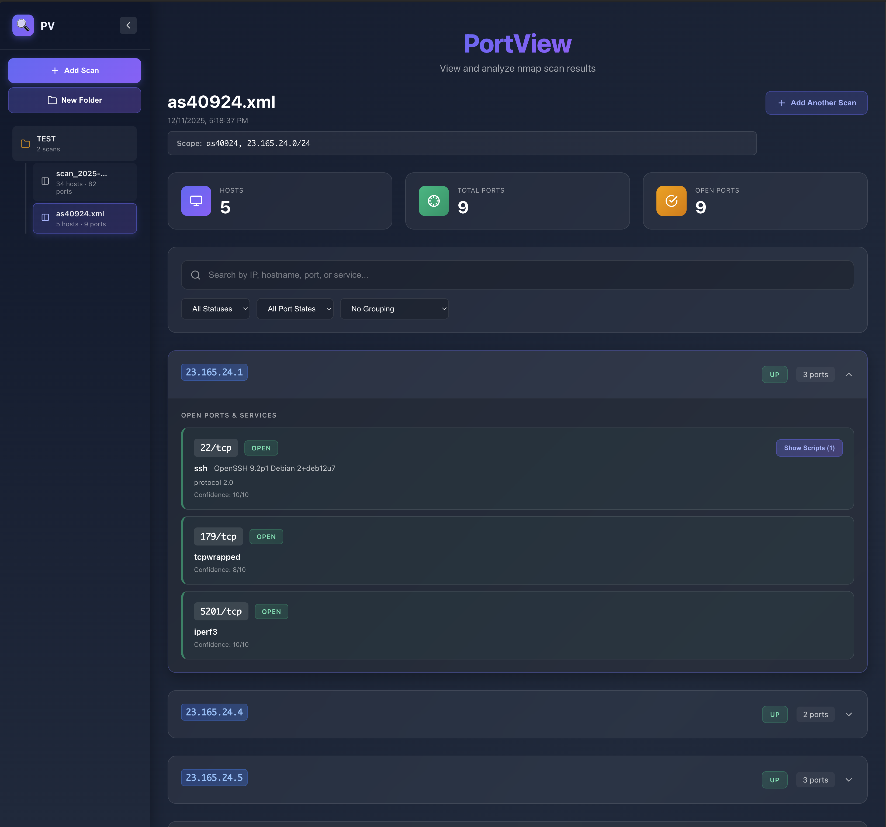

# PortView

A modern Vue.js app for viewing and analyzing nmap XML scan results. Upload your scans, explore hosts and services, and browse your network scan data.

> This project was vibe coded ✨



## Quick Start

### Docker (Recommended)

```bash
./start.sh    # Start
./stop.sh     # Stop
```

Access at `http://localhost:3000`

### Development

```bash
npm install
npm run dev
```

## Features

- 📤 Upload nmap XML files
- 🔍 Search by IP, hostname, port, or service
- 🎯 Filter by host status and port states
- 📊 Clean visualization of hosts and ports
- 📱 Responsive design

## Usage

Generate nmap XML output:

```bash
nmap -sV -O -oX scan.xml target.com
```

Then upload the XML file through the web interface.

## Tech Stack

- Vue 3
- Express.js
- SQLite
- Vite

## License

MIT
